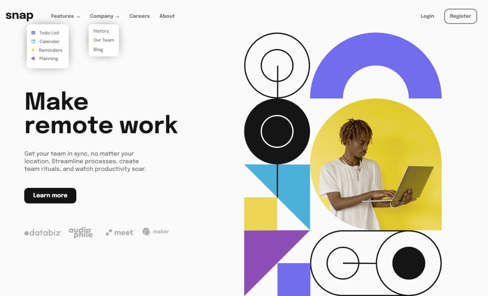

# Frontend Mentor - Intro section with dropdown navigation solution

This is a solution to the [Intro section with dropdown navigation challenge on Frontend Mentor](https://www.frontendmentor.io/challenges/intro-section-with-dropdown-navigation-ryaPetHE5). Frontend Mentor challenges help you improve your coding skills by building realistic projects. 

## Table of contents

- [Overview](#overview)
  - [The challenge](#the-challenge)
  - [Screenshot](#screenshot)
  - [Links](#links)
- [My process](#my-process)
  - [Built with](#built-with)
  - [What I learned](#what-i-learned)
  - [Continued development](#continued-development)
  - [Useful resources](#useful-resources)
- [Author](#author)
- [Acknowledgments](#acknowledgments)

## Overview

### The challenge

Users should be able to:

- View the relevant dropdown menus on desktop and mobile when interacting with the navigation links
- View the optimal layout for the content depending on their device's screen size
- See hover states for all interactive elements on the page

### Screenshot



### Links

- Solution URL: [Solution](https://github.com/SoulOfMo/intro-section-with-dropdown-navigation-main.git)
- Live Site URL: [Live Site](https://soulofmo.github.io/intro-section-with-dropdown-navigation-main/)

## My process

### Built with

- Semantic HTML5 markup
- CSS custom properties
- Flexbox
- CSS Grid
- Javascript

### What I learned
- I learned how to use javascript toggle function and addevent method.
- I learned how to use the picture tag.
- I learned how to remove br tag using css

<!-- Use this section to recap over some of your major learnings while working through this project. Writing these out and providing code samples of areas you want to highlight is a great way to reinforce your own knowledge. -->


```html
<picture>
  <source media="(max-width:425px)" srcset="./images/image-hero-mobile png" alt="avater" class="hero-mobile">
  
  </picture>
```
```css
h1 br {
  content: "";
}

h1 br::after {
 content: " ";
}
```
```js
asideFeatures.addEventListener("click", function(){
    asideDropdown.classList.toggle('show-aside-dropdown')
})
```

### Continued development

This is my first time implementing js in my project, and I still have a lot learning to do and it will be one of the area i will focusing on. 

<!-- Use this section to outline areas that you want to continue focusing on in future projects. These could be concepts you're still not completely comfortable with or techniques you found useful that you want to refine and perfect. -->

### Useful resources

- [Build 15 JavaScript Projects - Vanilla JavaScript Course](https://youtu.be/3PHXvlpOkf4) - This video from freecodecamp helped understand how to add a dropdown meun. I really liked this pattern and will use it going forward.


## Author

- Frontend Mentor - [@SoulOfMo](https://www.frontendmentor.io/profile/SoulOfmo)
- Twitter - [@morin_sultan](https://www.twitter.com/morin_sultan?s=09)

## Acknowledgments

This is to myself for not giving up.

